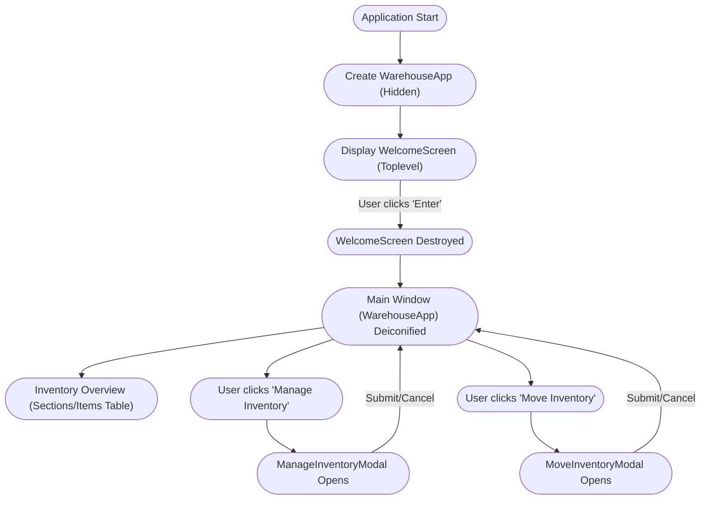
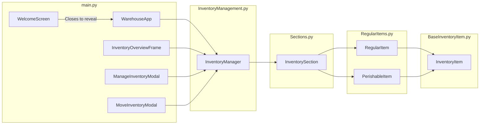

# Light Logistics Inventory Management

A Python application for managing warehouse inventory. Users can:

- Add new sections and items  
- Modify existing item quantities  
- Move inventory between sections  
- View an overview of all sections and their items in one place  

---

## Features

- **Welcome Screen**  
  - Provides an initial entry point for the user  

- **Single Main Window**  
  - Displays a table of existing sections and items  
  - Offers buttons to **Manage Inventory** (add/update items) and **Move Inventory** between sections  

- **Dialogs**  
  - **Manage Inventory**: Add new items or update existing quantities (including optional expiry dates)  
  - **Move Inventory**: Transfer stock between sections, including partial quantities  

- **Error Handling**  
  - Notifies the user of invalid operations (e.g., incorrect quantity)  

---

## User Journey Flow

**Below is a visual interpretation of the expected User journey flow for this application:**  



---
## System Architecture 

**Below is a visual interpretation of the expected System Architecture for this application:**  



---

## Requirements

1. **Python 3.8+** (3.10+ recommended)  
2. **Dependencies**:  
   - [CustomTkinter](https://github.com/TomSchimansky/CustomTkinter)  
   - [Pillow (PIL)](https://pypi.org/project/Pillow/)

Install them via:
```bash
pip install customtkinter Pillow